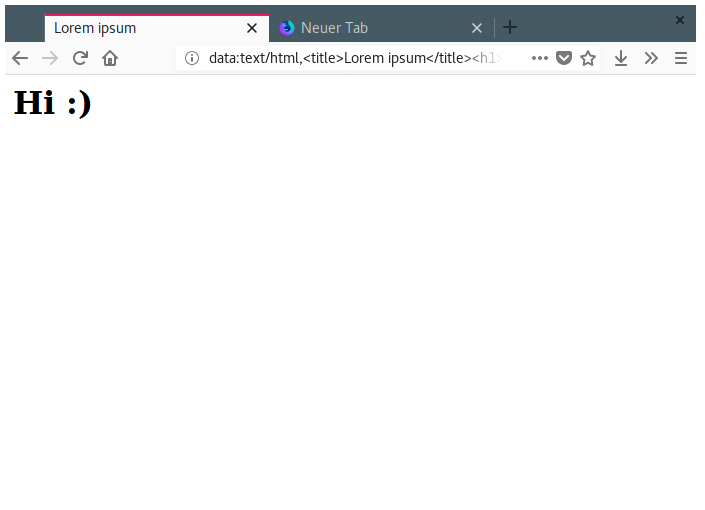

Paperfox
========

Mini-Howto for beginners like me
--------------------------------

1. Install npm:
    * Fedora: `sudo dnf install npm`
    * Ubuntu: `sudo apt-get install nodejs npm`
    * OS X, [via brew](https://brew.sh/): `brew install node`
    * Windows: I don't know ¯\\_(ツ)_/¯
    * [More infos](https://www.npmjs.com/get-npm)
2. Install dev dependencies (`web-ext`): `npm install`
3. Test your changes in Firefox: `npm run start:firefox`
4. Build unsigned ZIP: `npm build`

Use unsigned ZIP
----------------

Since AMO doesn't allow the upload and signing of WebExtension themes at the moment, you have to allow the installation of unsigned extensions in Firefox Nightly or Firefox Developer Edition to use this theme.

In `about:config` change `xpinstall.signatures.required` to `false`.

Screenshot
----------

